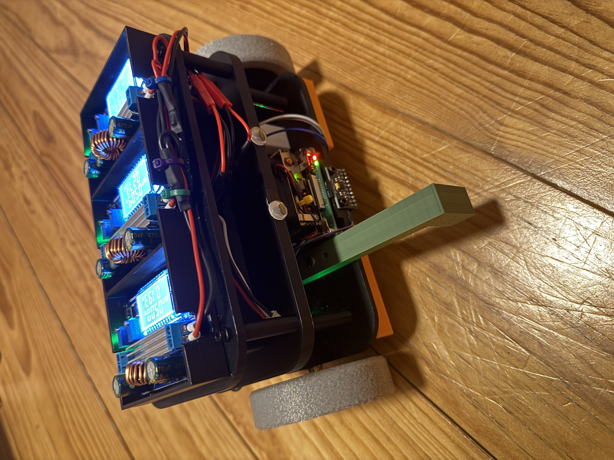
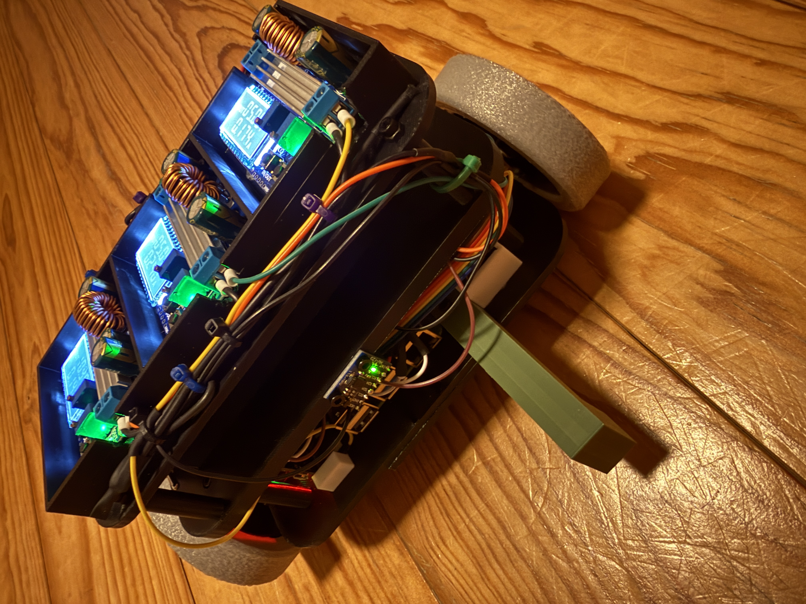
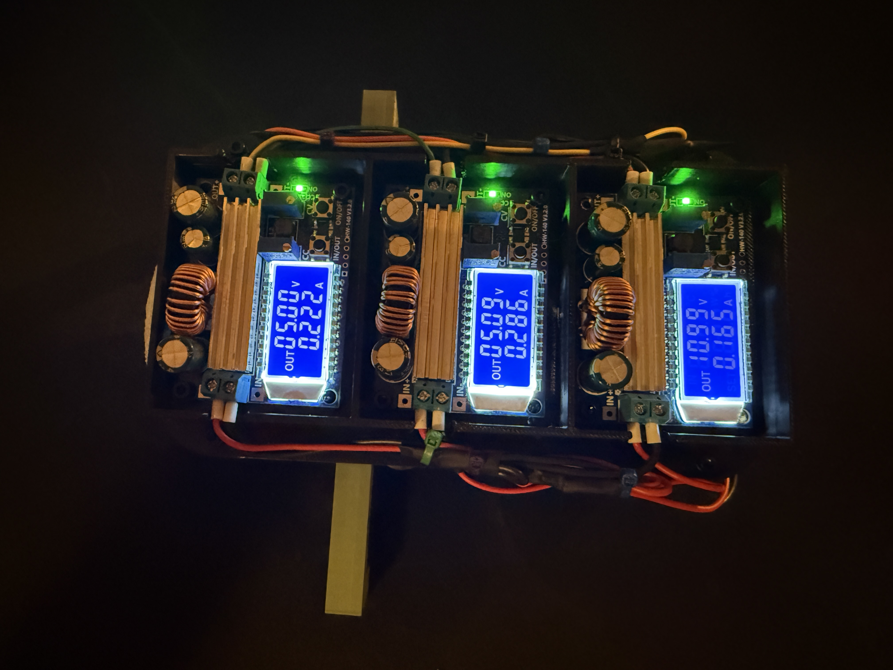
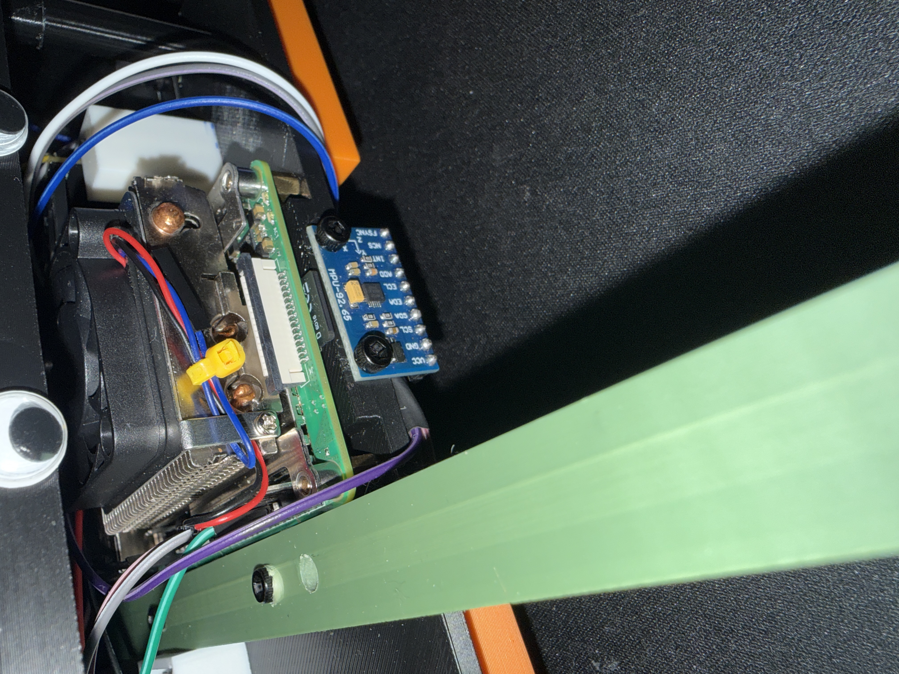
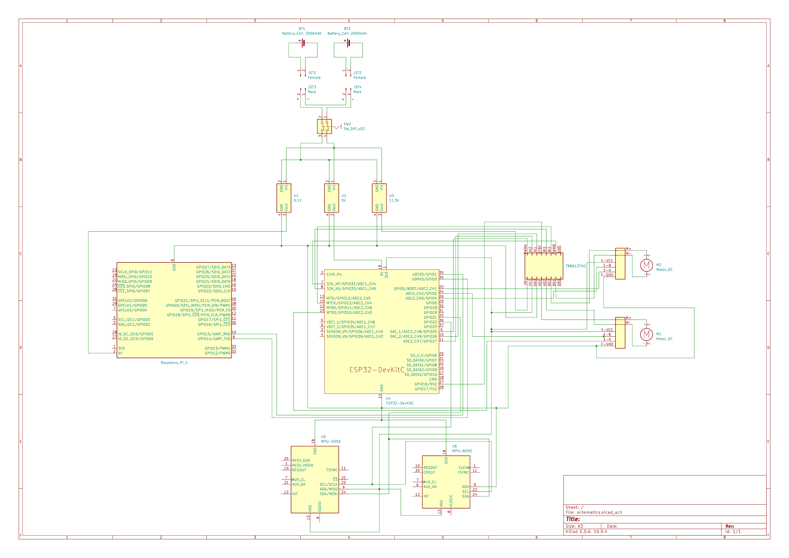

# ROS2 Self-Balancing Differential-Drive Robot


> A personal learning project — building a differential-drive robot from scratch
> using ROS2 on a Raspberry Pi 4, an ESP32 for real-time motor/sensor control,
> and a fully 3D-printed chassis.

**[Full documentation → dagebg.github.io/ros2-diffdrive-robot](https://dagebg.github.io/ros2-self-balancing-robot/)**

## Goals
The target end state is a two-wheeled self-balancing robot that:
- Balances itself using IMU sensor fusion feedback and a PID controller running on the ESP32
- The ESP32 runs a fast real-time balance loop (2xIMU → PID → motor commands)
- ROS2 on the Pi acts as the high-level layer, sending velocity targets without caring about the internal balance loop
- The chassis is being designed from scratch in Autodesk Fusion and Siemens NX and 3D-printed on a BambuLab P1S
- Controlling the controller over network with webapp

## Hardware

<p align="center">
  
  
</p>

| Component | Role |
|---|---|
| Raspberry Pi 4B 4GB | Main computer running ROS2 |
| ESP32 DevKit C V4 | Real-time motor control + IMU bridge |
| 2× N20 100 RPM + Hall encoders | Drive wheels + wheel odometry |
| TB6612FNG dual motor driver | Motor direction + PWM speed control |
| MPU-9250 9-DOF IMU | Accelerometer, gyroscope, magnetometer |
| MPU-6050 6-DOF IMU | Accelerometer, gyroscope|
| 2x 7.4V 2000mAh Li-Ion 2S | Main power source |
| 3x HW-140 DC-DC Buck Boost Converter | Power converter |
| 3D-printed chassis + wheels | Custom mechanical platform |

## Power System

The robot uses a multi-rail power architecture with dedicated buck converters for compute and embedded subsystems.  

<p align="center">
  
</p>

## Sensor Fusion Architecture

This robot uses two physically mounted IMUs at different locations and orientations for sensor fusion experimentation.

| IMU | Location | Orientation | Function |
|---|---|---|---|
| MPU-9250 | Lower deck | Facing forward | Primary IMU, 9-DOF orientation sensing |
| MPU-6050 | Second deck | Facing backward | Secondary IMU, comparison/reference sensing |

<p align="center">
  
  
</p>


## Electronics Documentation

The robot electronics are documented in KiCad with a complete schematic of the main system.

<p align="center">
  
</p>

Files:
- [`schematics.kicad_sch`](mechanical_hardware/schematics/schematics.kicad_sch)
- [`schematics.pdf`](mechanical_hardware/schematics/schematics.pdf)

## Repository layout

```text
ros2-diffdrive-robot/
├── ros2_ws/              ROS2 workspace (packages: diff drive, navigation, etc.)
├── firmware/             ESP32 firmware (motor controller, IMU bridge)
├── mechanical_hardware   CAD design & wiring schematics     
└── docs/                 Architecture notes + Sphinx documentation
```

## Documentation

- [Full Sphinx docs](https://dagebg.github.io/ros2-diffdrive-robot/)
- [Architecture overview](docs/ARCHITECTURE.md)
- [Networking setup (Pi ↔ Fedora)](docs/networking-pi-fedora.md)

## Status

Early WIP — ROS2 workspace and firmware development in progress.
